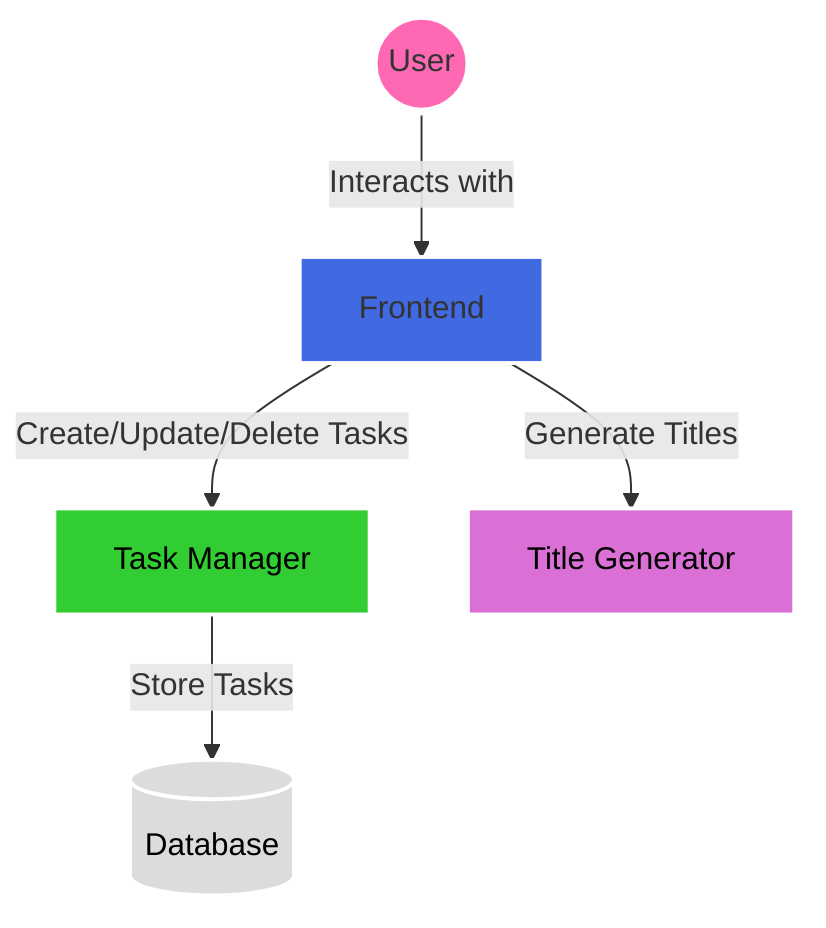

# Todoer

## Use Cases

### Create a Task

```gherkin
Feature: Create a Task
  As a user
  I want to create a task
  So that I can keep track of my tasks

  Scenario: Create a task
    Given I have a title "Buy milk"
    When I create a task
    Then I should see the task "Buy milk" in the list of tasks
```

### Update a Task

```gherkin
Feature: Update a Task
  As a user
  I want to update a task
  So that I can keep track of my tasks

  Scenario: Update a task
    Given I have a task "Buy milk"
    When I update the task to "Buy milk and bread"
    Then I should see the task "Buy milk and bread" in the list of tasks
```

### Mark task as Done

```gherkin
Feature: Mark task as Done
  As a user
  I want to mark a task as done
  So that I can keep track of my tasks

  Scenario: Mark a task as done
    Given I have a task "Buy milk"
    When I mark the task as done
    Then I should see the task "Buy milk" marked as done
```

### Delete a Task

```gherkin
Feature: Delete a Task
  As a user
  I want to delete a task
  So that I can keep track of my tasks

  Scenario: Delete a task
    Given I have a task "Buy milk"
    When I delete the task
    Then I should not see the task "Buy milk" in the list of tasks
```

### List Tasks

```gherkin
Feature: List Tasks
  As a user
  I want to list tasks
  So that I can keep track of my tasks

  Scenario: List tasks
    Given I have a task "Buy milk"
    And I have a task "Buy bread"
    When I list the tasks
    Then I should see the task "Buy milk" in the list of tasks
    And I should see the task "Buy bread" in the list of tasks
```

### Generate a Title

```gherkin
Feature: Generate a Title
  As a user
  I want to generate a title
  So that I can have a title for my tasks

  Scenario: Generate a title
    When I generate a title
    Then I should see a title
```

## Architecture



The system consists of three main components:

1. **Frontend**: User interface for task management
2. **Task Manager**: Handles CRUD operations for tasks
3. **Title Generator**: Generates random titles for tasks

Each component is independently deployable and communicates via RESTful APIs.

## Tech-Stack

### Frontend
- **Framework**: React with TypeScript
- **Styling**: Vanilla CSS

### Task Manager
- **Framework**: Node.js with Express and TypeScript
- **Database**: MongoDB

### Title Generator
- **Framework**: Node.js with Express and TypeScript


## Component Stages

| Component          | Commit Stage         |  UAT Stage            |  Production Stage     |
| ------------------ | -------------------- |-----------------------|-----------------------|
| **Frontend**        | [](https://github.com/josegarrera/todoer-fe/actions/workflows/commit.yml) | [](https://github.com/josegarrera/todoer-fe/actions/workflows/release.yml) | [](https://github.com/josegarrera/todoer-fe/actions/workflows/release.yml) |
| **Task Manager**    | [](https://github.com/josegarrera/todoer-task-manager/actions/workflows/commit.yml) | [](https://github.com/josegarrera/todoer-task-manager/actions/workflows/release.yml) | [](https://github.com/josegarrera/todoer-task-manager/actions/workflows/release.yml) |
| **Title Generator**| [](https://github.com/josegarrera/todoer-title-generator/actions/workflows/commit.yml) | [](https://github.com/josegarrera/todoer-title-generator/actions/workflows/release.yml) | [](https://github.com/josegarrera/todoer-title-generator/actions/workflows/release.yml) |

## System Stages

|                    | UAT Stage            |  Production Stage     |
| ------------------ | -------------------- |-----------------------|
| **System**         | [](https://github.com/josegarrera/todoer-acceptance/actions/workflows/uat-stage.yml) | [](https://github.com/josegarrera/todoer-acceptance/actions/workflows/uat-stage.yml) |

## Repository Strategy
This project follows a multi-repository strategy where each component is maintained in its own repository:

- [Frontend](https://github.com/josegarrera/todoer-fe)
- [Task Manager](https://github.com/josegarrera/todoer-task-manager)
- [Title Generator](https://github.com/josegarrera/todoer-title-generator)
- [System Tests](https://github.com/josegarrera/todoer-system-tests)

## Branching Strategy
This project follows a feature branching strategy where each feature is developed in its own branch and merged into `main` via a pull request.